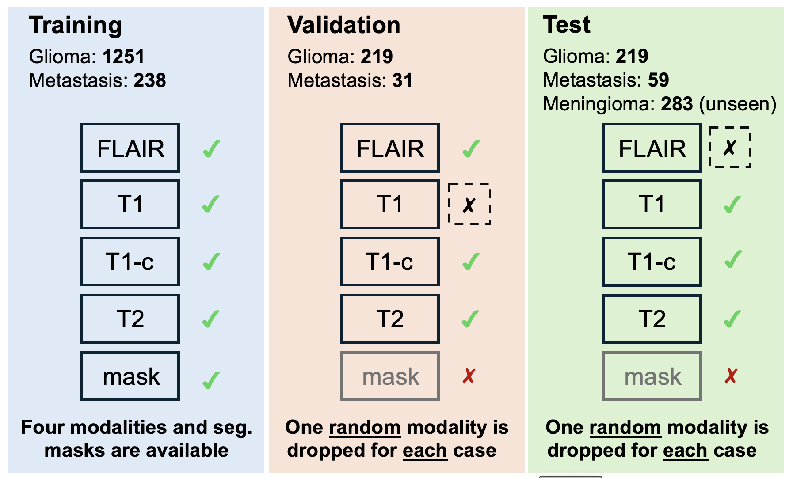
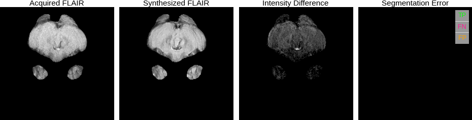

# BraSyn tutorial
This is a tutorial for participants to quickly get hands-on with the [BraSyn Lighthouse Challenge](https://www.synapse.org/Synapse:syn64153130/wiki/631457) at MICCAI 2025. 

The goal of **BraSyn challenge** is to generate one missing modality given three MRI sequences available during inference. 

## 📚 Resources from BraSyn-2024 at MICCAI'2024
(1) [Method descriptions of all teams](https://drive.google.com/drive/folders/1gnAkSqiOJ2I0zkARj7heQLHO_AVDdzG-?usp=sharing). (2) [Presentation slides at MICCAI'2024](https://docs.google.com/presentation/d/1XyJT6I96lgN6qp6hyDIQyXYKr2NotuxQ/edit?usp=drive_link&ouid=109496030661252703481&rtpof=true&sd=true). 

## General Setting

The BraSyn-2025 dataset is based on the BraTS-GLI 2023 dataset, BraTS-Metastasis 2023, and BraTS-Meningioma. 

It describes a retrospective collection of brain tumor mpMRI scans acquired from multiple institutions under standard clinical conditions but with different imaging protocols, resulting in a vastly heterogeneous image quality across different institutions. 

During the validation and test stages, the segmentation mask corresponding to images is unavailable for each subject, and one of the four modalities will be randomly excluded (`dropout').

The participants are required to synthesize **one arbitrary** missing modality.






## Expected input and output folder structures
This year, we have switched to using Docker containers as the submission format. The submitted container is expected to take an input folder containing all test subjects. In each subject's subfolder, one modality (FLAIR, T1, T2, or T1-c) is randomly dropped. Here is [an example of a pseudo test set](https://drive.google.com/file/d/1rEjYU5I790kBZahcJZyyPzkJyiKpEh1D/view?usp=sharing).
```
/input_folder_example/
└── BraTS-GLI-01667-000/
    └── BraTS-GLI-01667-000-t1n.nii.gz
        BraTS-GLI-01667-000-t2f.nii.gz
        BraTS-GLI-01667-000-t2w.nii.gz

└── BraTS-MEN-01346-000/
    └── BraTS-MEN-01346-000-t1c.nii.gz
        BraTS-MEN-01346-000-t2f.nii.gz
        BraTS-MEN-01346-000-t2w.nii.gz

└── BraTS-MET-00777-000/
    └── BraTS-MET-00777-000-t1c.nii.gz
        BraTS-MET-00777-000-t1n.nii.gz
        BraTS-MET-00777-000-t2f.nii.gz
```

So your container is expected to generate the missing modalities and store them in one single main folder (**without sub-folders, please**). Here is [an example of the expected output](https://drive.google.com/file/d/1ZbQgUkS2K6NXvZaF45nJKySDhFaR50yI/view?usp=sharing) given the previous pseudo test set.
```
/output_folder_example/
└── BraTS-GLI-01667-000-t1c.nii.gz
    BraTS-MEN-01346-000-t1n.nii.gz
    BraTS-MET-00777-000-t2w.nii.gz
```


## How to generate tumor segmentation masks from four MRI modalities (three real + one synthetic images)?
Once the missing modality is generated, we can do image segmentation with the four modalities using well-established algorithms (pre-trained models). 
One option is using previous BraTS best segmentation algorithms (with GPUs) available here: https://github.com/BrainLesion/BraTS. 
To do this, you would need to [install Docker](https://docs.docker.com/engine/install/) and the _brats_ package via: 
```
pip install brats
```
Then you could run the provided _segmentation.py_ on one folder containing the subjects: 
```
python segmentation.py -i /your/input/folder/path -o /your/output/folder/path --gpu 0
```
Here is [one example for testing](https://drive.google.com/file/d/1_75QK4-H_bRICgFb7ODeEDB4OQCV25xY/view?usp=sharing). After running the script on this folder, you will expect to get the [segmentations](https://drive.google.com/file/d/1kHoxAPp9ey83n5qCeeEhO-tI7yoauiTt/view?usp=sharing). 

### Hwo to compute metrics?

After segmentation, one could compute metrics (Dice + Hausdorff distance 95 percentile) by comparing the output with reference labels. 
We provide the script named _get_segmentation_metric.py_ to do this. Please install supporting packages via: 
```
pip install numpy nibabel pandas medpy
```
Then you could run the script providing two folders - one with output segmentations ([example](https://drive.google.com/file/d/1kHoxAPp9ey83n5qCeeEhO-tI7yoauiTt/view?usp=sharing)), the other one with ground truth ([example](https://drive.google.com/file/d/1zOfzNUaDxmSR1NImCV9GV-IQ7E4k9Ynm/view?usp=sharing)). 
After running the script on the example data, one will see the following output with csv format: 
```
Subject,Dice_label1,HD95_label1,Dice_label2,HD95_label2,Dice_label3,HD95_label3
BraTS-GLI-01667-000-seg.nii.gz,0.9156,1.4142,0.9758,1.0,0.9787,1.0
BraTS-MEN-01346-000-seg.nii.gz,0.7051,3.8669,0.9963,0.0,0.9956,0.0
BraTS-MET-00777-000-seg.nii.gz,0.9922,0.0,0.9992,0.0,0.9958,0.0

```


## A simple 3D baseline

The baseline model simulates a scenario where a random modality is missing during training, enhancing the model's ability to handle missing modalities during inference.

To get started, please clone this repo by:
```
git clone https://github.com/WinstonHuTiger/BraSyn_tutorial.git
```

### Environment setup

It is recommended to use [Mamba](https://mamba.readthedocs.io/en/latest/) for faster environment and package management compared to Anaconda. Install Mamba following the insctruction [here](https://mamba.readthedocs.io/en/latest/installation/mamba-installation.html) and create a virtual environment as follows:
```
mamba create -n brasyn python=3.10
mamba activate brasyn
```

Alternatively, you can use Conda:

```
conda create -n brasyn python=3.10
conda activate brasyn
```


To install [Pytorch](https://pytorch.org/) on your machine with Cuda compatibility, you can just use the following command:

```
mamba install pytorch==2.1.2 torchvision==0.16.2 torchaudio==2.1.2 pytorch-cuda=11.8 -c pytorch -c nvidia
```
or using conda:
```
conda install pytorch==2.1.2 torchvision==0.16.2 torchaudio==2.1.2 pytorch-cuda=11.8 -c pytorch -c nvidia
```

The minimum Pytorch version requirement is 1.9.0. If you want to install other version (your CUDA version is much lower than 11.8), please refer to [Pytorch installing docs](https://pytorch.org/get-started/previous-versions/). 


Then please install other dependencies by the following command:
```
cd project
pip install -r requirements.txt
```

### Inference
The inference pipeline can be summarized as following:
<image src="assets/inference_flow_chart.png" />

According the submission requirements, images are stored in a folder and model reads the processed images with cropped dimension ($144 \times 192 \times 192$) and generate the missing modality for the given input images. After the missing modality is generated, post-processed algorithm pads the images back to original dimension ($256 \times 256 \times 256 $).

To infer on your own machine, you have to do the following things:
- Run ```python drop_modality.py``` on your own machine to generate random missing modality MRI input sequence and please remember to change the ```val_set_folder``` to where you store your training dataset. 
- Change the ```data_path``` in ```project/generate_missing_modality.py``` to the same as the ```val_set_missing``` in ```drop_modality.py```.
- If you don't want to save the generated modality back to the data_path, change ```save_back``` in ```infer()``` function to ```False```
- Change the ```output_path``` in ```project/generate_missing_modality.py```, if you did the last step. 
- Run ```python project/generate_missing_modality.py``` to generate the missing modality.


If you are interested in training your own simple baseline model, you first have to start the visdom server on your machine by ```visdom``` and then you can modify the following command:

```
cd project/
python train.py \
     --dataroot your_dataset_root_path \
     --name your_checkpoint_name \
     --model pix2pix --direction AtoB --dataset_mode brain_3D_random_mod \
     --B_modality random \
     --n_epochs 50 --n_epochs_decay 70 \
     --lr 0.0001 --input_nc 3 --output_nc 1 \
     --paired --netG sit --netD n_layers --n_layers_D 1 \
     --batch_size 1 --gpu_ids 0 
```
**Note**: The minimum GPU memory requirement is 24GB, and the training time is about 28 hours on a single 4090 RTX GPU.
After the training, you are able to view the Structural Similarity (SSIM) Index and Peak Signal-to-Noise Ratio (PSNR)  metric in the output. SSIM indicates the structural similarity, such as tissue similarity in our case here. As for the segmentation (Dice) score, we have discussed it in [inference](#inference). You are also welcome to include other metrics in your own research. 

 ## Citation
 Please cite our work if you find this tutorial useful.
```
@misc{li2023brain,
      title={The Brain Tumor Segmentation (BraTS) Challenge 2023: Brain MR Image Synthesis for Tumor Segmentation (BraSyn)}, 
      author={Hongwei Bran Li and Gian Marco Conte and Syed Muhammad Anwar and Florian Kofler and Ivan Ezhov and Koen van Leemput and Marie Piraud and Maria Diaz and Byrone Cole and Evan Calabrese and Jeff Rudie and Felix Meissen and Maruf Adewole and Anastasia Janas and Anahita Fathi Kazerooni and Dominic LaBella and Ahmed W. Moawad and Keyvan Farahani and James Eddy and Timothy Bergquist and Verena Chung and Russell Takeshi Shinohara and Farouk Dako and Walter Wiggins and Zachary Reitman and Chunhao Wang and Xinyang Liu and Zhifan Jiang and Ariana Familiar and Elaine Johanson and Zeke Meier and Christos Davatzikos and John Freymann and Justin Kirby and Michel Bilello and Hassan M. Fathallah-Shaykh and Roland Wiest and Jan Kirschke and Rivka R. Colen and Aikaterini Kotrotsou and Pamela Lamontagne and Daniel Marcus and Mikhail Milchenko and Arash Nazeri and Marc André Weber and Abhishek Mahajan and Suyash Mohan and John Mongan and Christopher Hess and Soonmee Cha and Javier Villanueva and Meyer Errol Colak and Priscila Crivellaro and Andras Jakab and Jake Albrecht and Udunna Anazodo and Mariam Aboian and Thomas Yu and Verena Chung and Timothy Bergquist and James Eddy and Jake Albrecht and Ujjwal Baid and Spyridon Bakas and Marius George Linguraru and Bjoern Menze and Juan Eugenio Iglesias and Benedikt Wiestler},
      year={2023},
      eprint={2305.09011},
      archivePrefix={arXiv},
```
```
@misc{https://doi.org/10.48550/arxiv.2207.00844,
  author = {Hu, Qingqiao and Li, Hongwei and Zhang, Jianguo},  
  title = {Domain-Adaptive 3D Medical Image Synthesis: An Efficient Unsupervised Approach},
  publisher = {arXiv},
  year = {2022},
}


```

 ## Aknowledgement
The 3D synthesis baseline is from [2D_VAE_UDA_for_3D_sythesis](https://github.com/WinstonHuTiger/2D_VAE_UDA_for_3D_sythesis). 

The 3D backbone is from [3D-MRI-style-transfer](https://github.com/KreitnerL/3D-MRI-style-transfer).

The training framework is from [pytorch-CycleGAN-and-pix2pix](https://github.com/junyanz/pytorch-CycleGAN-and-pix2pix).

Some utility functions are from Bran's [BraSyn](https://github.com/hongweilibran/BraSyn).

Thanks for their wonderful opensource works!!!
